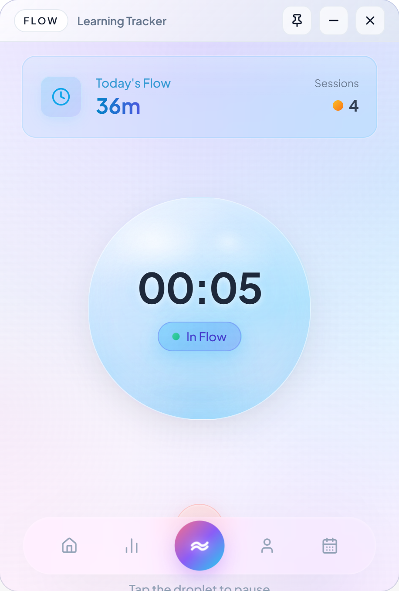

<div align="center">
  
  <h1>FLOW</h1>
  <p>专注时间追踪与学习节奏管理桌面应用（Tauri + React）</p>
</div>

## 应用介绍

FLOW 是一款离线优先的专注学习追踪应用，帮助你建立可持续的学习节奏：专注计时、任务安排、可视化统计、成就激励，一站式管理你的学习与专注状态。

## 功能特性

- **专注计时**：可开始/暂停/结束专注，会话自动记录
- **数据统计**：日/周/月专注时长与趋势分析
- **热力图**：全年学习活跃度可视化
- **任务与日程**：待办、事件、提醒统一管理
- **成就系统**：里程碑解锁与激励
- **主题与设置**：深色模式、语言切换
- **声音与触感反馈**：操作音效与触感提示（可全局开关）
- **离线优先**：本地存储，无需联网

## 技术栈

- **前端**：React 19 + TypeScript + Vite
- **桌面容器**：Tauri v2 + Rust
- **状态管理**：Zustand
- **本地存储**：SQLite（rusqlite）
- **国际化**：i18next

## 快速开始

### 1. 安装依赖

```bash
npm install
```

### 2. 开发模式

```bash
npm run tauri dev
```

### 3. 生产构建

```bash
npm run tauri build
```

构建产物位于 `src-tauri/target/release/bundle/`。

## 项目结构

```
FLOW/
├─ components/           # React UI 组件
├─ i18n/                 # 国际化词典与初始化
├─ services/             # Tauri API 封装与反馈服务
│  ├─ userService.ts
│  ├─ sessionService.ts
│  ├─ taskService.ts
│  ├─ achievementService.ts
│  ├─ settingsService.ts
│  └─ feedbackService.ts
├─ stores/               # Zustand 状态管理
│  ├─ userStore.ts
│  ├─ sessionStore.ts
│  ├─ taskStore.ts
│  └─ settingsStore.ts
├─ src-tauri/            # Tauri 后端 (Rust)
│  ├─ src/
│  │  ├─ commands/       # Tauri Commands (API)
│  │  ├─ db/             # 数据库模块
│  │  ├─ models/         # 数据模型
│  │  ├─ lib.rs          # 应用入口
│  │  └─ main.rs         # 主函数
│  ├─ migrations/        # 数据库迁移脚本
│  └─ Cargo.toml         # Rust 依赖配置
├─ App.tsx               # React 应用主组件
├─ index.html            # HTML 入口
├─ index.tsx             # React 入口
├─ types.ts              # TypeScript 类型定义
├─ vite.config.ts        # Vite 配置
└─ package.json          # Node.js 依赖配置
```

## 应用截图

| 首页                             | 专注计时                           | 统计                               |
| -------------------------------- | ---------------------------------- | ---------------------------------- |
|  |  |  |

| 任务                               | 成就                                             | 设置                                     |
| ---------------------------------- | ------------------------------------------------ | ---------------------------------------- |
|  |  |  |

## 数据存储位置

- **Windows**：`C:\Users\<用户名>\AppData\Roaming\com.tauri.dev\flow.db`
- **macOS**：`~/Library/Application Support/com.tauri.dev/flow.db`
- **Linux**：`~/.local/share/com.tauri.dev/flow.db`

## License

MIT License
